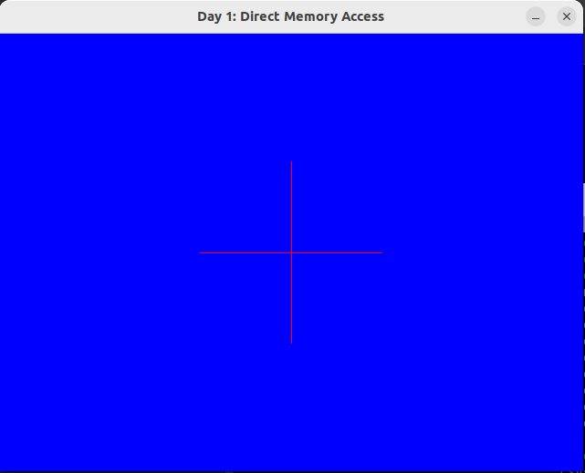
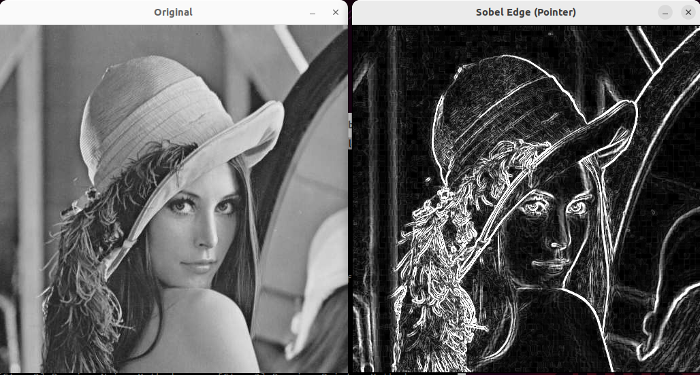
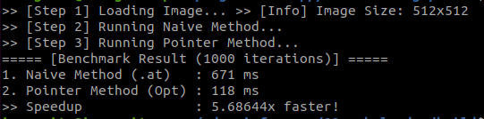
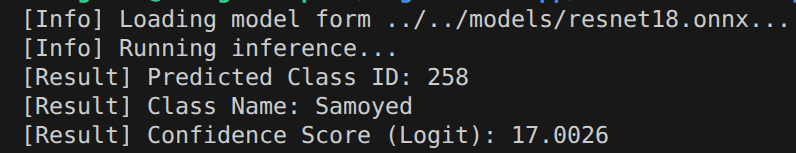
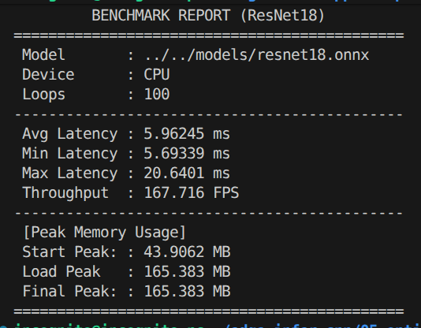

# Edge AI Inference Engine: C++ Optimization Log

**Project Goal:** To develop a high-performance, lightweight computer vision & AI inference system optimized for **Edge Devices** (Linux/Embedded). This project focuses on minimizing memory overhead, maximizing CPU cache locality, and implementing core algorithms from scratch using C++.

---

## Development Roadmap & Status

| Day | Module | Topic | Status |
| :---: | :--- | :--- | :---: |
| **01** | **Pixel Control** | Direct Memory Access & Row-Major Order Analysis | Completed |
| **02** | **Image Processing** | Sobel Edge Detection (Convolution) & Benchmarking | Completed |
| **03** | **Model Conversion** | PyTorch to ONNX Pipeline | Completed |
| **04** | **Inference Engine** | ONNX Runtime C++ Integration | Completed |
| **05** | **Optimization** | Latency & Memory Profiling | Completed |

---

## Day 1: Direct Memory Access (Foundation)

**Objective**
To understand `cv::Mat` memory layout (Row-Major Order) and implement pixel manipulation using raw pointers (`uchar*`) to avoid function call overhead.

### Key Implementation
- **Memory Analysis:** Analyzed how 2D images are flattened into 1D memory blocks.
- **Pointer Arithmetic:** Replaced high-level API (`at<Vec3b>`) with direct memory address calculations.

### Code Snippet
```cpp
// Direct memory access for optimization
// Calculating offset manually: index = (row * width + col) * channels
int index = (y * width + x) * 3; 
data[index] = 0; // Access Blue channel directly

// [Correction] Use 'step' to handle memory padding alignment
// index = y * image.step + x * image.elemSize();
int index = y * src.step + x * 3;
```
### Result Visualization


## Day 2: High-Performance Convolution (Optimization)
**Objective**
Implement Sobel Edge Detection from scratch and conduct a performance benchmark between "Naive Implementation" and "Pointer Optimization".

### Theory & Strategy
- **Convolution:** Implemented a 3x3 sliding window algorithm to calculate spatial gradients ($G_x, G_y$).
- **Memory Optimization:**
    - **Naive Method:** Uses `image.at<uchar>(y, x)` which includes boundary checks for safety but incurs high overhead.
    - **Pointer Method:** Uses `uchar* ptr` to access memory addresses directly. This minimizes instruction cycles and maximizes CPU Cache Hits (Spatial Locality).

### Implementation Details (Code Snippet)
```cpp
// Optimized: Pointer Arithmetic (No function call overhead)
const uchar* ptr_prev = src.ptr<uchar>(y - 1);
const uchar* ptr_curr = src.ptr<uchar>(y);
const uchar* ptr_next = src.ptr<uchar>(y + 1);

// Accessing pixels directly via pointers
int gx = -ptr_prev[x-1] + ptr_prev[x+1] - 2*ptr_curr[x-1] + ...
```

### Performance Benchmark & Analysis    

#### Evaluation Environment
To ensure the reliability of the results, all tests were conducted in a controlled environment:
* **CPU:** 13th Gen Intel(R) Core(TM) i7-1370P (20 vCPUs, 24MB Cache)
* **OS:** Linux (Ubuntu 22.04.5 LTS)
* **Compiler:** `g++` (Ubuntu 11.4.0-1ubuntu1~22.04.2)
* **Optimization Flag:** `-O3` (Highest Optimization Level)
* **Input:** 512x512 Grayscale Image / **Iterations:** 1,000 loops

#### Benchmark Results
| Implementation Method |Total Time (1000 runs) | Avg Time per Frame | Speedup Factor |
| :--- | :--- | :--- | :--- |
| **Naive Implementation** | 671 ms | 0.671 ms | 1.0x |
| **Optimized Pointer** | **118 ms** | **0.118 ms** | **5.69x Faster** |

*(Note: The pointer optimization significantly reduces CPU cycles by maximizing cache locality.)*

### Result Visualization



### **Key Insight & Future Implications**
The **5.69x speedup** achieved through manual pointer optimization and memory locality enhancement provides critical advantages for Edge AI systems:

1.  **Computational Budget Realignment:** By drastically reducing the preprocessing (Sobel) overhead, we can allocate more CPU/GPU cycles to the actual Inference Stage, allowing for more complex model architectures.
2.  **Edge-Ready Efficiency:** This optimization is essential for achieving high FPS in **resource-constrained environments** (e.g., Jetson Nano, Raspberry Pi) where every millisecond of latency determines the system's real-time reliability.
3.  **Scalability:** The same memory access pattern can be extended to other convolution-based filters or custom tensor operations in the inference engine.

## Day 3: Model Conversion (PyTorch to ONNX)
**Objective**
Prepares a production-ready AI model by converting a PyTorch-based ResNet18 into the ONNX (Open Neural Network Exchange) format. This step is crucial for detaching the model from the heavy Python dependency and enabling high-performance inference in C++.

### Workflow
1. **Model Selection:** ResNet18 pre-trained on ImageNet
2. **Graph tracing:** Used torch.onnx.export with a dummy input tensor (1, 3, 224, 224) to trace the execution graph.
3. **Optimization:** Applied Constant Folding to pre-compute static graph nodes, reducing the computational load during inference.

### Key Technical Decisions
* **model.eval():** Switched the model to evaluation mode to fix Batch Normalization statistics and disable Dropout layers, ensuring deterministic output.
* **opset_version=18:** Utilized a modern ONNX operator set to support the latest neural network layers, ensuring compatibility with the ONNX Runtime engine.
* **Dynamic Axes (Optional):** While fixed batch sizes were used for the edge implementation, the script supports configuring dynamic axes for flexible batch processing if needed.

### Implementation Details (Code Snippet)
```py
# Export Configuration
torch.onnx.export(
    model,
    dummy_input,
    onnx_file_path,
    opset_version=18,
    export_params=True,
    do_constant_folding=True,
    input_names=['input'],
    output_names=['output'],
)
```

## Day 4: C++ Inference Engine Implementation
**Objective**
Build a standalone, high-performance inference engine using C++17 and Microsoft ONNX Runtime (ORT). This engine loads the converted model and performs image classification without any Python environment.

### System Architecture
* **Inference Backend:** ONNX Runtime C++ API (replacing OpenCV DNN for better compatibility and performance).
* **Preprocessing:** OpenCV (cv::Mat) is used strictly for image loading and resizing. Pixel normalization (ImageNet Mean/Std) and layout conversion (HWC -> CHW) are implemented manually in C++ for maximum control.
* **Post-processing:** Mapping the output index to human-readable class names (ImageNet 1000 classes).

### Key Features
* **Type Safety:** Utilized C++17 features and ORT's type-safe APIs to prevent runtime errors.
* **Direct Memory Mapping:** Used `Ort::MemoryInfo::CreateCpu` to map C++ vectors directly to ONNX tensors, minimizing unnecessary memory copies.
* **Robust Error Handling:** Implemented try-catch blocks to handle model loading failures or invalid inputs gracefully.

### Core Logic (Code Snippet)
```cpp
// 1. Create Session
Ort::Env env(ORT_LOGGING_LEVEL_WARNING, "ResNet18");
Ort::Session session(env, model_path.c_str(), session_options);

// 2. Preprocessing & Input Tensor Creation
// (Image data is flattened and normalized before creating the tensor)
auto memory_info = Ort::MemoryInfo::CreateCpu(OrtArenaAllocator, OrtMemTypeDefault);
Ort::Value input_tensor = Ort::Value::CreateTensor<float>(
    memory_info, input_tensor_values.data(), input_tensor_values.size(), input_shape.data(), input_shape.size()
);

// 3. Inference Execution
auto output_tensors = session.Run(
    Ort::RunOptions{nullptr},
    input_names_arr, &input_tensor, 1,
    output_names_arr, 1
);
```

### Execution Result
*(Input Image: Samoyed Dog)*



## Day 5: Performance Benchmarking & Optimization
**Objective**
Develop a standalone C++ benchmarking tool using the Microsoft ONNX Runtime (ORT) API directly. The goal is to rigorously quantify system performance (Latency & Memory Footprint) and verify real-time capabilities on the target hardware.

### Tech Stack
* **Inference Engine:** ONNX Runtime 1.x (CPU Execution Provider)
* **Language:** C++17
* **Profiling Tools:**
    * `std::chrono`: High-resolution timing for precise latency measurement.
    * `sys/resource.h`: Linux system call (getrusage) to track Resident Set Size (RSS) memory usage.

### Implementation Highlights
1. **Direct ONNX Runtime Integration:** Utilized `onnxruntime_cxx_api.h` to manage sessions, tensors, and memory environments directly, bypassing high-level wrappers for maximum control.
2. **Manual Memory Management:** Implemented raw pixel manipulation to convert OpenCV's HWC (Height-Width-Channel) layout to ONNX's CHW (Channel-Height-Width) layout manually.
3. **System-Level Profiling:**
    * **Warm-up Phase:** Executed 10 initial runs to stabilize CPU instruction cache and memory arena.
    * **Memory Tracking:** Monitored peak RAM usage at three critical stages: Baseline, Post-Load, and Post-Inference.

### Benchmark Code Logic (Code Snippet)
```cpp
// 1. Memory Profiling (Linux System Call)
double get_memory_usage() {
    struct rusage usage;
    if (getrusage(RUSAGE_SELF, &usage) == 0) {
        return usage.ru_maxrss / 1024.0; // Convert KB to MB
    }
    return -1.0;
}

// 2. High-Precision Timing
auto start_time = std::chrono::high_resolution_clock::now();
session.Run(Ort::RunOptions{nullptr}, ...);
auto end_time = std::chrono::high_resolution_clock::now();
```

### Performance Report
*(Tested on ResNet18(ONNX), CPU Backend, 100 Iterations)*


### Analysis & Engineering Insight
* **Hyper Real-time:** The average latency of ~6ms (167 FPS) is significantly faster than the OpenCV DNN backend (~15ms), proving the efficiency of ORT's graph optimizations.
* **Scalability:** With >160 FPS throughput, this single-core CPU implementation provides enough headroom to process 5+ concurrent video streams or perform heavy post-processing tasks.
* **Stability:** The memory usage remained perfectly constant (165.38 MB) throughout the loop, indicating zero memory leaks.

## Technical Decisions & Troubleshooting

During the development, I encountered several compatibility issues between PyTorch's latest export logic and the inference engines. Here is the summary of how I resolved them:

### 1. From OpenCV DNN to ONNX Runtime
Initially, I attempted to use `cv::dnn::readNetFromONNX` for its simplicity. However, the latest PyTorch (`torch.onnx.export`) enforces **Opset 18 (IR Version 10)** when using dynamic axes, which is not fully supported by OpenCV 4.x.
- **Decision:** Migrated the inference backend to **ONNX Runtime C++ (v1.19.2)**, which fully supports the latest ONNX operators and offers better performance optimization.

### 2. ONNX Runtime Version Mismatch
A critical error (`Unsupported model IR version: 10`) occurred with ONNX Runtime v1.17.1.
- **Analysis:** The exported model required IR Version 10, but the installed runtime only supported up to IR Version 9.
- **Solution:** Upgraded ONNX Runtime to **v1.19.2** (Linux x64) and reconfigured `CMakeLists.txt` to link against the new library version.

### 3. Preprocessing Optimization
To maximize performance, I implemented a manual preprocessing pipeline in C++:
- Direct **HWC (OpenCV) to CHW (ONNX)** memory layout conversion.
- Applied ImageNet Normalization (Mean/Std) during the layout transform loop to minimize memory access overhead.

---